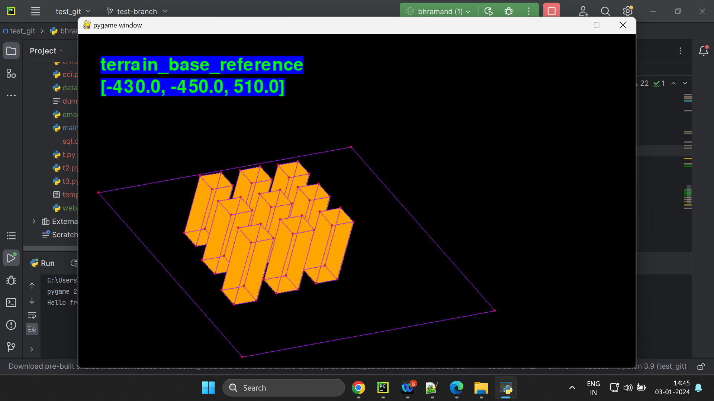

<h1>Project Bhramand</h1>

 Test Link: <a href="./assets/" title="With a Title">
example link</a>.

 

Objective: Bhramand Strata
    >> Visualize everything [KnowledgeMap, Code coupler, C&C headquarter, Mind palace]
    >> Entity ecosystem [People, bots and evolution][What are the pre-reqs of evolution/ascension?]
    >> Peripheral Interaction with p-Space [Internal as well as Wild with aux machines/minions/bots]

Stage I:
    Cam traversal - Code to move cam plane [Trans+Rot]
    Project nodes onto plane
    Orient nodes in viewing plane

Stage II:
    Include perspective scaling based on distance [Cam block]
    Add occlusion to dhow closer surfaces

Stage III:
    Create 3-D object builder
    Complete viewport interaction [Aug peripherals]
    Replace planes with surfaces and render images & text

Aux:
    Unit testing, logging, VCS, CI/CD
    Minion assimilation

 

 1. This version has Perspective projected city block

